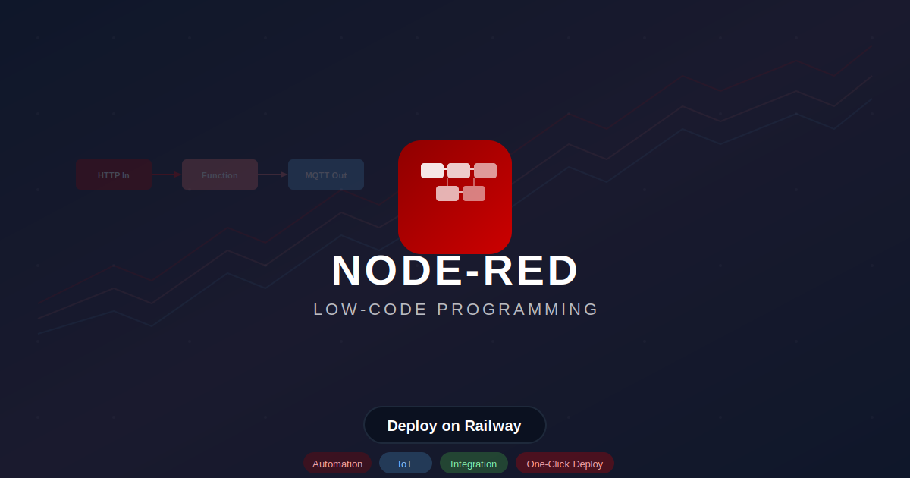
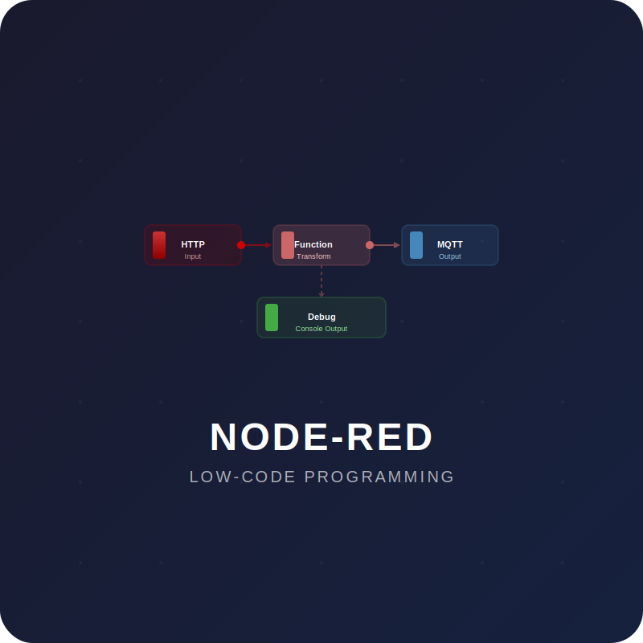

# Node-RED — Low-Code Programming for Event-Driven Applications

[](https://railway.app/template/railway-node-red)
[](https://nodered.org)
[](https://www.apache.org/licenses/LICENSE-2.0)
[](https://github.com/node-red/node-red)

<p align="center">
  
</p>

Deploy **Node-RED** on Railway with one click — a flow-based, low-code development tool for wiring together hardware devices, APIs, and online services. Drag and drop nodes to create automations, data pipelines, and integrations without writing boilerplate code.

---

## Features

- **Flow-based programming** — wire together inputs and outputs visually in the browser
- **50,000+ community nodes** — extend with MQTT, HTTP, WebSocket, database, cloud API, and hardware nodes
- **Built-in editor** — drag-and-drop flow builder with live deployment
- **Library of flows** — import/export reusable flow templates
- **Dashboard UI** — optional node-red-dashboard for web-based user interfaces
- **REST API** — full admin HTTP API for remote management
- **Lightweight & embeddable** — runs on as little as 128MB RAM
- **Persistent flows** — Railway volume mounts retain your flows across redeploys

---

## Environment Variables

| Variable | Default | Description |
|---|---|---|
| `FLOWS` | `flows.json` | Flow file to load from /data |
| `CREDENTIAL_SECRET` | *(auto-generated)* | Key for encrypting flow credentials |
| `NODE_RED_ENABLE_PROJECTS` | `false` | Enable projects feature |
| `NODE_RED_ENABLE_SAFE_MODE` | `false` | Start without running flows (troubleshooting) |
| `NODE_OPTIONS` | *(empty)* | Additional Node.js runtime options |

---

## Architecture

```
┌────────────────────────────────────────────────────────┐
│                    Railway Container                      │
│                                                           │
│  ┌─────────────────────────────────────────────────┐     │
│  │              Node-RED v5.0.0                     │     │
│  │                                                   │     │
│  │  ┌─────────┐ ┌──────────┐ ┌──────────────────┐  │     │
│  │  │   Flow   │ │  Admin   │ │    Dashboard     │  │     │
│  │  │  Engine  │ │   API    │ │  (node-red-dash) │  │     │
│  │  └────┬────┘ └────┬─────┘ └────────┬─────────┘  │     │
│  │       │            │                │             │     │
│  │  ┌────▼────────────▼────────────────▼─────────┐   │     │
│  │  │          HTTP Server (Port 1880)             │   │     │
│  │  │   ┌──────────────────────────────────┐      │   │     │
│  │  │   │  /  (Flow Editor + Admin API)     │      │   │     │
│  │  │   └──────────────────────────────────┘      │   │     │
│  │  └────────────────────────────────────────────┘   │     │
│  │                                                   │     │
│  │  ┌──────────────────────────────────────────┐     │     │
│  │  │       Persistent Volume (/data)           │     │     │
│  │  │  ┌──────────┐ ┌─────────┐ ┌─────────┐   │     │     │
│  │  │  │flows.json│ │settings │ │  .npm   │   │     │     │
│  │  │  │          │ │ .js     │ │  cache  │   │     │     │
│  │  │  └──────────┘ └─────────┘ └─────────┘   │     │     │
│  │  └──────────────────────────────────────────┘     │     │
│  └─────────────────────────────────────────────────┘     │
│                                                           │
└─────────────────────────────────────────────────────────┘
```

Node-RED runs as a single container with a persistent volume at `/data` for flows, settings, credentials, and npm cache. The health check at the root path (`/`) ensures Railway can monitor service availability.

---

## Deploy and Host

### About Hosting

Node-RED runs as a single Docker container with a persistent volume at `/data` for all runtime state — flows, settings, credentials, and npm cache. It requires no external database, no message queue, and no sidecar services. The built-in admin API and flow editor are served directly from the container, making it a true zero-dependency deployment.

Railway provides automatic HTTPS, global CDN, health monitoring, and persistent volumes. The health check at `/` (root path) ensures Railway can monitor service availability.

- **Default Port:** 1880
- **Health Check:** `GET /` — admin API root returns HTTP 200 when ready
- **Startup Time:** ~5-10 seconds (Node.js process startup)
- **Resource Usage:** ~50-80MB RAM idle, scales as flows execute
- **Data Directory:** `/data` (persistent volume for flows, settings, credentials)

### Health Endpoint

Railway uses the following endpoint for health checks:
- **URL:** `/`
- **Timeout:** 30 seconds
- **Start period:** 30 seconds (allows Node-RED to initialize)

---

## Why Deploy Node-RED on Railway?

| Feature | Benefit |
|---------|---------|
| **Zero configuration** | Just deploy — the flow editor is immediately available in your browser |
| **50,000+ community nodes** | Extend with any integration imaginable via npm |
| **Visual development** | No coding required for common automation patterns |
| **Persistent flows** | Railway volumes keep your flows safe across redeploys |
| **One-click deploy** | Deploy from GitHub or Railway button in under a minute |
| **Auto HTTPS** | Railway provides TLS termination automatically |
| **Lightweight** | ~50MB idle RAM — fits comfortably on free tier |

With Railway, you get automatic HTTPS, global CDN, health monitoring, and scalable infrastructure — without managing servers.

---

## Common Use Cases

- **Home automation** — Wire together MQTT, HTTP, and Zigbee nodes for smart home control
- **IoT data pipelines** — Collect sensor data from edge devices, transform it, and send to databases or cloud APIs
- **API integration** — Bridge between REST, WebSocket, GraphQL, and SOAP services without glue code
- **Webhook automation** — Receive webhooks from GitHub, Stripe, Slack, etc., and trigger workflows
- **Data transformation** — Parse, filter, and route data between systems with drag-and-drop logic
- **Prototyping** — Rapidly prototype integrations and automations before building production code
- **Alerting & notifications** — Route system alerts through email, Slack, Telegram, or SMS nodes

---

## Dependencies for Node-RED

### Deployment Dependencies

- **Runtime:** Node-RED v5.0.0 (bundled in the container image on Node.js 24)
- **Storage:** Persistent volume at `/data` for flows, settings, credentials, and npm cache
- **External access:** Port 1880 for the flow editor and admin API
- **Optional:** Credential secret key for encrypting flow credentials
- **Optional:** node-red-dashboard node for web-based UI dashboards

---

<p float="left">
  
  
</p>

---

## Getting Started

### Deploy on Railway

1. Click the **Deploy on Railway** button above
2. Configure any environment variables (optional)
3. Click deploy
4. Access the Node-RED flow editor at `https://<your-railway-url>:1880`

### Local Development

```bash
# Build the Docker image
docker build -t railway-node-red .

# Run the container
docker run -d \
  --name node-red \
  -p 1880:1880 \
  -v node-red-data:/data \
  railway-node-red

# Verify it's running
curl http://localhost:1880/
```

---

## Troubleshooting

**Flows not persisting across redeploys?**
Ensure the Railway volume is mounted at `/data`. The volume stores `flows.json`, `flows_cred.json`, and `settings.js`.

**Health check failing?**
The startup period is 30 seconds. Node-RED needs time to initialize Node.js and load flows. If it persists, check logs: `railway logs`.

**Port already in use?**
The container exposes port 1880. If you need a different internal port, modify the `EXPOSE` line in the Dockerfile.

**Credential errors after redeploy?**
If you didn't set `CREDENTIAL_SECRET`, Node-RED generates a system key on first start. This key is lost on redeploy if the `/data` volume is not persisted. Set `CREDENTIAL_SECRET` to a fixed value to make credentials portable across deployments.

**Can't install community nodes?**
Due to Railway's ephemeral filesystem, custom nodes installed via the palette manager may not persist across restarts. To add custom nodes permanently, either:
1. Build a custom Dockerfile that installs them with `npm install node-red-contrib-<name>`
2. Pre-install them in the `/data` volume directory

---

## Updating Node-RED

This template uses `nodered/node-red:latest`. To pin to a specific version:

1. Change the `FROM` line in `Dockerfile` to `nodered/node-red:5.0.0` (or the desired tag)
2. Rebuild and redeploy

Check [Node-RED Releases](https://github.com/node-red/node-red/releases) and [Docker Tags](https://hub.docker.com/r/nodered/node-red/tags) for the latest version.

---

## License

Node-RED is [Apache-2.0 licensed](https://github.com/node-red/node-red/blob/master/LICENSE).

This Railway template is provided by [INAPP-Mobile](https://github.com/INAPP-Mobile). Not affiliated with or endorsed by the Node-RED project.
